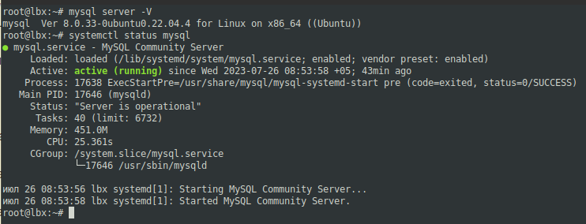
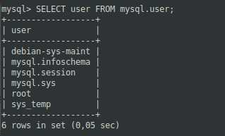
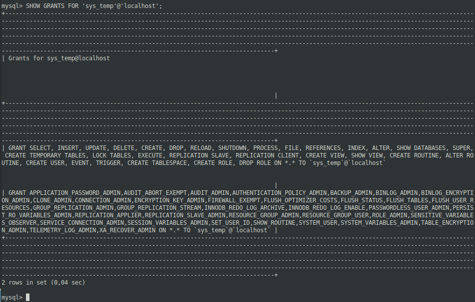
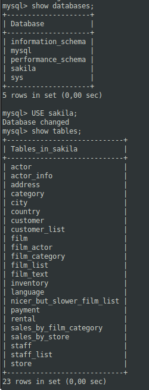
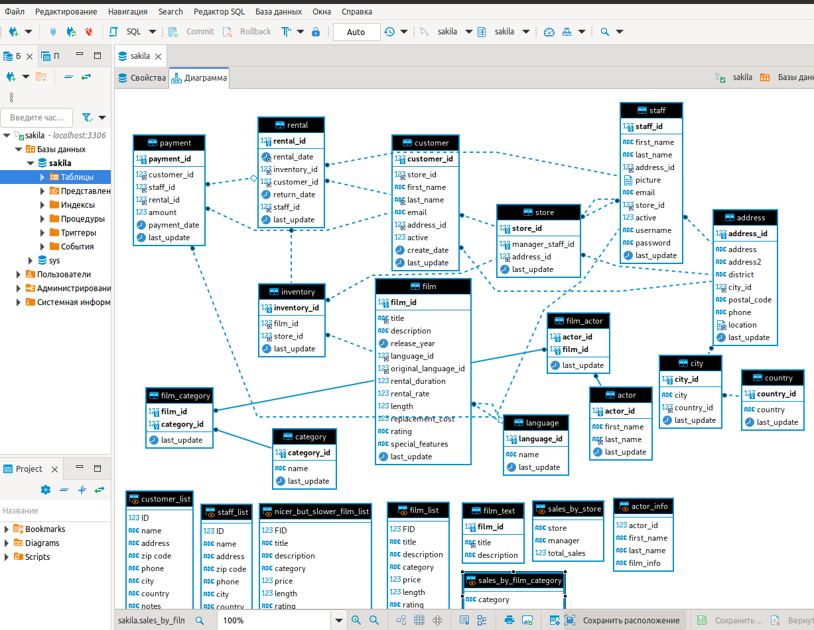
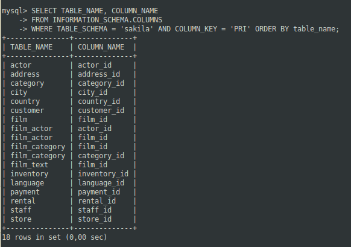
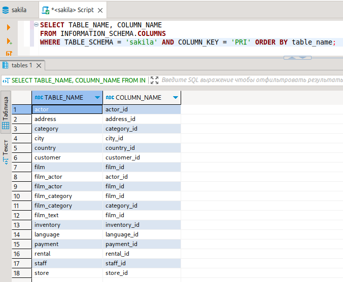
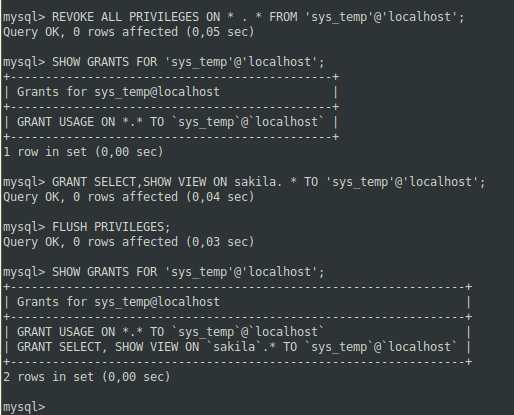

# 12.02. Работа с данными (DDL/DML) - Лебедев Д.С.

### Задание 1
> 1.1. Поднимите чистый инстанс MySQL версии 8.0+. Можно использовать локальный сервер или контейнер Docker.
> 1.2. Создайте учётную запись sys_temp.
> 1.3. Выполните запрос на получение списка пользователей в базе данных. (скриншот)
> 1.4. Дайте все права для пользователя sys_temp.
> 1.5. Выполните запрос на получение списка прав для пользователя sys_temp. (скриншот)
> 1.6. Переподключитесь к базе данных от имени sys_temp.
> Для смены типа аутентификации с sha2 используйте запрос:  
> ```sh
> ALTER USER 'sys_temp'@'localhost' IDENTIFIED WITH mysql_native_password BY 'password';
> ```
> 1.6. По ссылке https://downloads.mysql.com/docs/sakila-db.zip скачайте дамп базы данных.
> 1.7. Восстановите дамп в базу данных.
> 1.8. При работе в IDE сформируйте ER-диаграмму получившейся базы данных. При работе в командной строке используйте команду для получения всех таблиц базы данных. (скриншот)
> *Результатом работы должны быть скриншоты обозначенных заданий, а также простыня со всеми запросами.*

*Ответ:*  

1. Установка MySQL (linux mint)
```sh
sudo su
apt install mysql-server
systemctl status mysql
mysql -u root
```



2. Создание учетной записи sys_temp  
```sh
CREATE USER 'sys_temp'@'localhost' IDENTIFIED BY '1234';
```

3. Запрос на получение списка пользователей в базе данных  
```
SELECT user FROM mysql.user;
```



4. Передача всех прав новому пользователю  
```sh
GRANT ALL PRIVILEGES ON *.* TO 'sys_temp'@'localhost';
```

5. Просмотр имеющихся прав  
```sh
SHOW GRANTS FOR 'sys_temp'@'localhost';
```



Смена типа аутентификации пользователя, переподключение к БД  
```sh
ALTER USER 'sys_temp'@'localhost' IDENTIFIED WITH mysql_native_password BY '1234';
exit
mysql -u sys_temp -p
```

6. Качаем дамп, распаковка  
```sh
cd /tmp
wget https://downloads.mysql.com/docs/sakila-db.zip
unzip sakila-db.zip
rm sakila-db.zip
```

7. Создание БД и восстановление из скачанного дампа  
```sh
mysql -u root
create database sakila;
exit

cd ./sakila-db
mysql < sakila-schema.sql
mysql < sakila-data.sql
mysqldump -u root sakila > sakila-data.sql
```

8. Получаем список таблиц в CLI и диаграмму в IDE  
```sh
show databases;
USE sakila;
show tables;
```

  



### Задание 2
> Составьте таблицу, используя любой текстовый редактор или Excel, в которой должно быть два столбца: в первом должны быть названия таблиц восстановленной базы, во втором названия первичных ключей этих таблиц. Пример: (скриншот/текст)  
> ```sh
> Название таблицы | Название первичного ключа
> customer         | customer_id
> ```

*Ответ:*  
Для вывода таблиц с ключами можно использовать запрос к БД:  
```sh
SELECT TABLE_NAME, COLUMN_NAME
FROM INFORMATION_SCHEMA.COLUMNS
WHERE TABLE_SCHEMA = 'sakila' AND COLUMN_KEY = 'PRI' ORDER BY table_name;
```

  

Тот же запрос в IDE  



### Задание 3*
> 3.1. Уберите у пользователя sys_temp права на внесение, изменение и удаление данных из базы sakila.
> 3.2. Выполните запрос на получение списка прав для пользователя sys_temp. (скриншот)
> *Результатом работы должны быть скриншоты обозначенных заданий, а также простыня со всеми запросами.*

*Ответ:*  
По итогам задания 1.4 пользователь sys_temp имеет все привилегии. Просматриваем еще раз:  
```sh
SHOW GRANTS FOR 'sys_temp'@'localhost';
```

Лишаем пользователя всех привилегий, присваиваем только SELECT, SHOW VIEW на нужную БД, обновляем таблицу прав пользователя следующими командами (под рутом):  
```sh
REVOKE ALL PRIVILEGES ON * . * FROM 'sys_temp'@'localhost';
SHOW GRANTS FOR 'sys_temp'@'localhost';
GRANT SELECT,SHOW VIEW ON sakila. * TO 'sys_temp'@'localhost';
FLUSH PRIVILEGES;
SHOW GRANTS FOR 'sys_temp'@'localhost';
```

