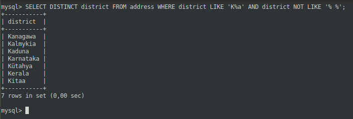
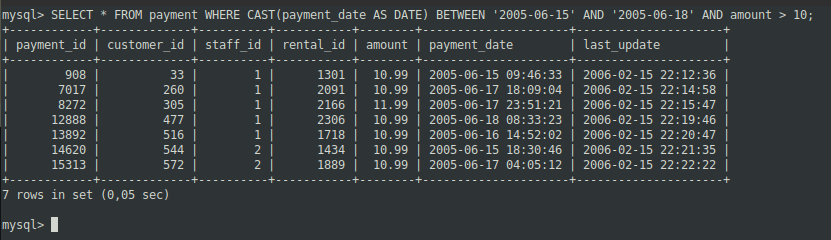
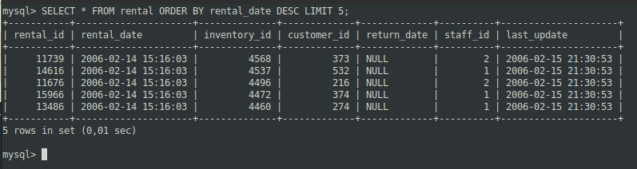
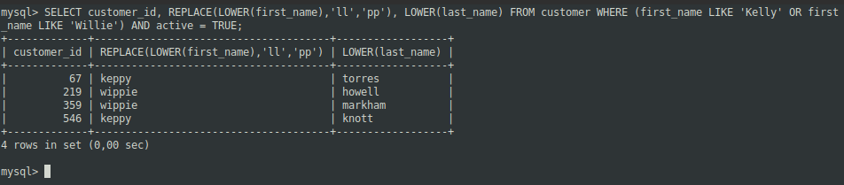
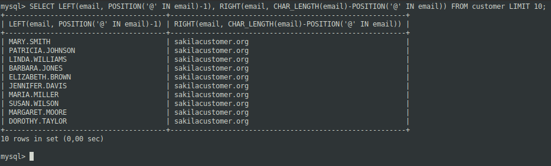
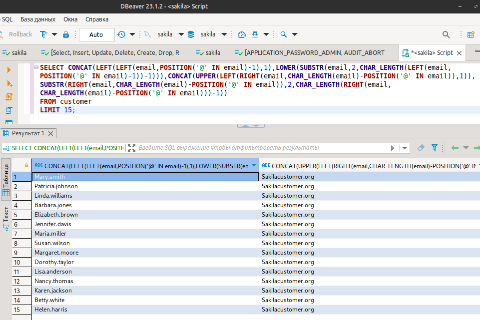

# 12.03. SQL. Часть 1 - Лебедев Д.С.

### Задание 1
> Получите уникальные названия районов из таблицы с адресами, которые начинаются на “K” и заканчиваются на “a” и не содержат пробелов.

*Ответ:*  
```sql
SELECT DISTINCT district FROM address WHERE district LIKE 'K%a' AND district NOT LIKE '% %';
```



### Задание 2
> Получите из таблицы платежей за прокат фильмов информацию по платежам, которые выполнялись в промежуток с 15 июня 2005 года по 18 июня 2005 года включительно и стоимость которых превышает 10.00.

*Ответ:*  
```sql
SELECT * FROM payment WHERE CAST(payment_date AS DATE) BETWEEN '2005-06-15' AND '2005-06-18' AND amount > 10;
```



### Задание 3
> Получите последние пять аренд фильмов.

*Ответ:*  
```sql
SELECT * FROM rental ORDER BY rental_date DESC LIMIT 5;
```



### Задание 4
> Одним запросом получите активных покупателей, имена которых Kelly или Willie.  
> Сформируйте вывод в результат таким образом:
> - все буквы в фамилии и имени из верхнего регистра переведите в нижний регистр,
> - замените буквы 'll' в именах на 'pp'.

*Ответ:*  
```sql
SELECT customer_id, REPLACE(LOWER(first_name),'ll','pp'), LOWER(last_name) FROM customer WHERE (first_name LIKE 'Kelly' OR first_name LIKE 'Willie') AND active = TRUE;
```



### Задание 5*
> Выведите Email каждого покупателя, разделив значение Email на две отдельных колонки: в первой колонке должно быть значение, указанное до @, во второй - значение, указанное после @.

*Ответ:*  
```sql
SELECT LEFT(email, POSITION('@' IN email)-1), RIGHT(email, CHAR_LENGTH(email)-POSITION('@' IN email)) FROM customer LIMIT 10;
```



### Задание 6*
> Доработайте запрос из предыдущего задания, скорректируйте значения в новых колонках: первая буква должна быть заглавной, остальные - строчными.

*Ответ:*  
```sql
SELECT CONCAT(LEFT(LEFT(email,POSITION('@' IN email)-1),1),LOWER(SUBSTR(email,2,CHAR_LENGTH(LEFT(email,
POSITION('@' IN email)-1))-1))),CONCAT(UPPER(LEFT(RIGHT(email,CHAR_LENGTH(email)-POSITION('@' IN email)),1)),
SUBSTR(RIGHT(email,CHAR_LENGTH(email)-POSITION('@' IN email)),2,CHAR_LENGTH(RIGHT(email,
CHAR_LENGTH(email)-POSITION('@' IN email)))-1))
FROM customer
LIMIT 15;
```


