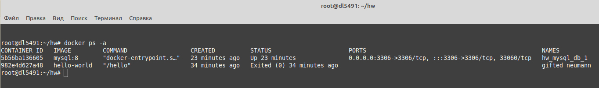
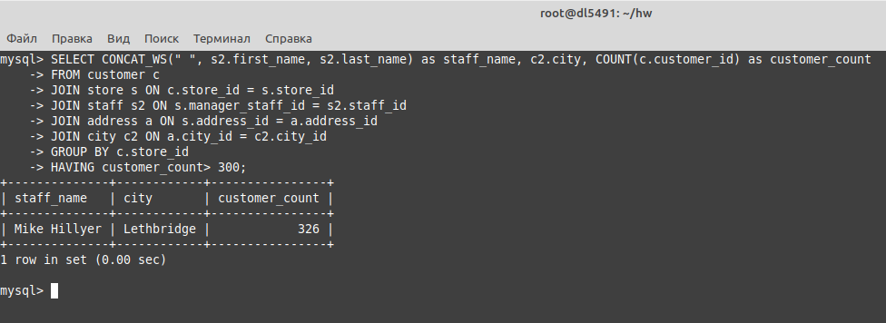
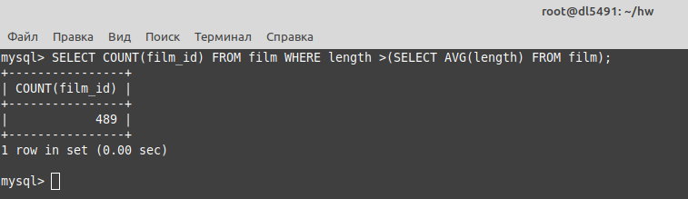
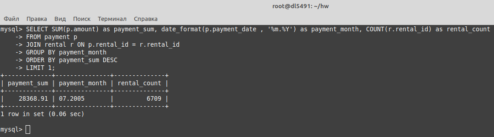
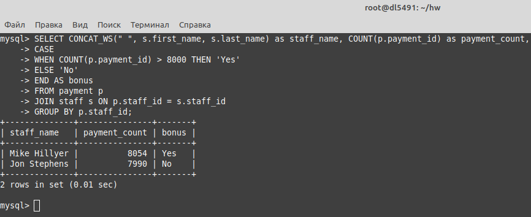
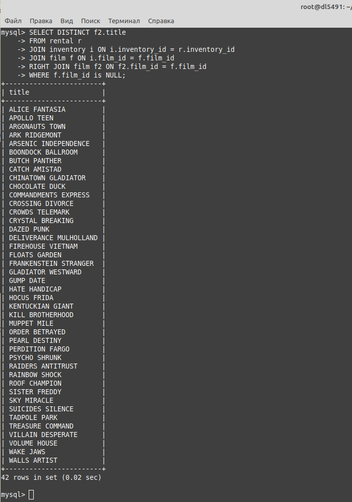

# 12.04. SQL. Часть 2 - Лебедев Д.С.

MySql запущена через docker compose, БД sakila развернута из дампа в контейнере  



### Задание 1
> Одним запросом получите информацию о магазине, в котором обслуживается более 300 покупателей, и выведите в результат следующую информацию:
> - фамилия и имя сотрудника из этого магазина;
> - город нахождения магазина;
> - количество пользователей, закреплённых в этом магазине.

*Ответ:*  
```sql
SELECT CONCAT_WS(" ", s2.first_name, s2.last_name) as staff_name, c2.city, COUNT(c.customer_id) as customer_count
FROM customer c
JOIN store s ON c.store_id = s.store_id
JOIN staff s2 ON s.manager_staff_id = s2.staff_id
JOIN address a ON s.address_id = a.address_id
JOIN city c2 ON a.city_id = c2.city_id
GROUP BY c.store_id
HAVING customer_count> 300;
```



### Задание 2
> Получите количество фильмов, продолжительность которых больше средней продолжительности всех фильмов.

*Ответ:*  
```sql
SELECT COUNT(film_id) FROM film WHERE length >(SELECT AVG(length) FROM film);
```



### Задание 3
> Получите информацию, за какой месяц была получена наибольшая сумма платежей, и добавьте информацию по количеству аренд за этот месяц.

*Ответ:*  
```sql
SELECT SUM(p.amount) as payment_sum, date_format(p.payment_date , '%m.%Y') as payment_month, COUNT(r.rental_id) as rental_count
FROM payment p
JOIN rental r ON p.rental_id = r.rental_id
GROUP BY payment_month
ORDER BY payment_sum DESC
LIMIT 1;
```



### Задание 4*
> Посчитайте количество продаж, выполненных каждым продавцом. Добавьте вычисляемую колонку «Премия». Если количество продаж превышает 8000, то значение в колонке будет «Да», иначе должно быть значение «Нет».

*Ответ:*  
```sql
SELECT CONCAT_WS(" ", s.first_name, s.last_name) as staff_name, COUNT(p.payment_id) as payment_count,
CASE
WHEN COUNT(p.payment_id) > 8000 THEN 'Yes'
ELSE 'No'
END AS bonus
FROM payment p
JOIN staff s ON p.staff_id = s.staff_id
GROUP BY p.staff_id;
```



### Задание 5*
> Найдите фильмы, которые ни разу не брали в аренду.

*Ответ:*  
```sql
SELECT DISTINCT f2.title
FROM rental r
JOIN inventory i ON i.inventory_id = r.inventory_id
JOIN film f ON i.film_id = f.film_id
RIGHT JOIN film f2 ON f2.film_id = f.film_id
WHERE f.film_id is NULL;
```

