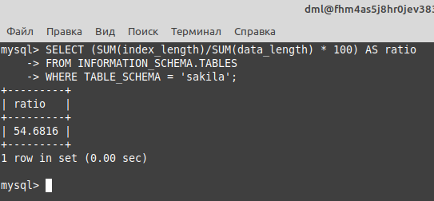
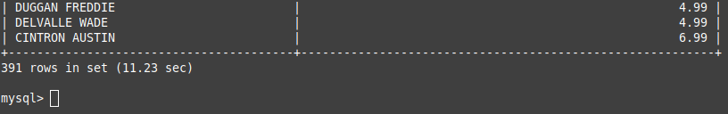
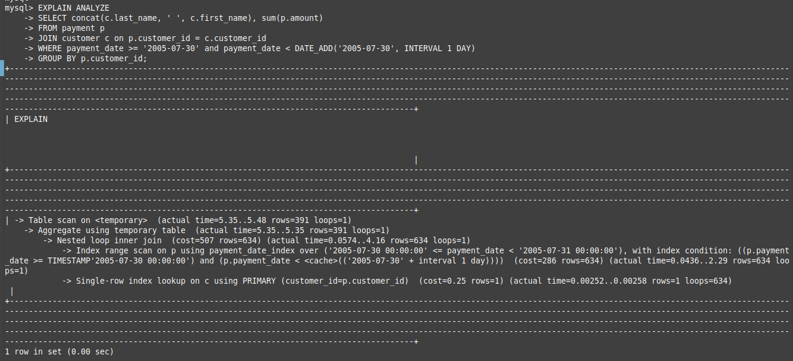
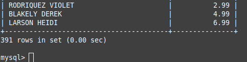
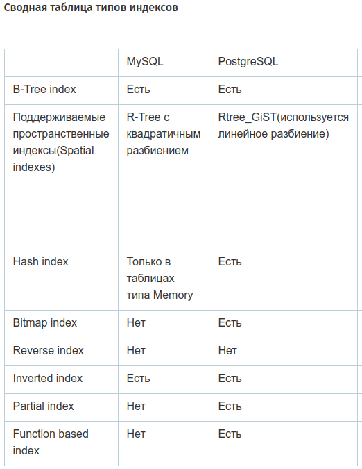

# 12.05. Индексы - Лебедев Д.С.

### Задание 1
> Напишите запрос к учебной базе данных, который вернёт процентное отношение общего размера всех индексов к общему размеру всех таблиц.

*Ответ:*  
```sql
SELECT (SUM(index_length)/SUM(data_length) * 100) AS ratio
FROM INFORMATION_SCHEMA.TABLES
WHERE TABLE_SCHEMA = 'sakila';
```



### Задание 2
> Выполните explain analyze следующего запроса:  
> ```sql
> select distinct concat(c.last_name, ' ', c.first_name), sum(p.amount) over (partition by c.customer_id, f.title)
> from payment p, rental r, customer c, inventory i, film f
> where date(p.payment_date) = '2005-07-30' and p.payment_date = r.rental_date and r.customer_id = c.customer_id and i.inventory_id = r.inventory_id
> ```
> - перечислите узкие места;
> - оптимизируйте запрос: внесите корректировки по использованию операторов, при необходимости добавьте индексы.

*Ответ:*  

 Узкие места:
 - Используется ненужное обращение к таблицам;
 - Не используется индекс

Время выполнения запроса составило больше 11 секунд, это неприемлемо. В данном случае происходит перебор всей таблицы.

  

Шаги оптимизации:
- Добавляем индекс по полю payment_date:
```sql
CREATE INDEX payment_date_index ON payment (payment_date);
```

- Оптимизируем запрос, удаляя обращение к неиспользуемым таблицам, убираем функцию `date`, используем индекс `payment_date_index`, не используем `distinct` и `over`:

```sql
EXPLAIN ANALYZE
SELECT concat(c.last_name, ' ', c.first_name), sum(p.amount)
FROM payment p
JOIN customer c on p.customer_id = c.customer_id
WHERE payment_date >= '2005-07-30' and payment_date < DATE_ADD('2005-07-30', INTERVAL 1 DAY)
GROUP BY p.customer_id;
```





Время выполнения запроса <u>значительно</u> уменьшилось.

### Задание 3*
> Самостоятельно изучите, какие типы индексов используются в PostgreSQL. Перечислите те индексы, которые используются в PostgreSQL, а в MySQL — нет.
> *Приведите ответ в свободной форме.*

*Ответ:*  
[Обзор типов индексов](https://habr.com/ru/articles/102785/)  
В PostgreSQL используются следующие индексы, которых нет в MySQL:
- Bitmap index
- Partial index
- Function based index

