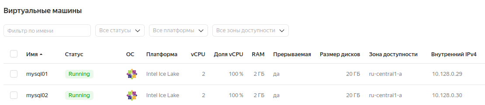
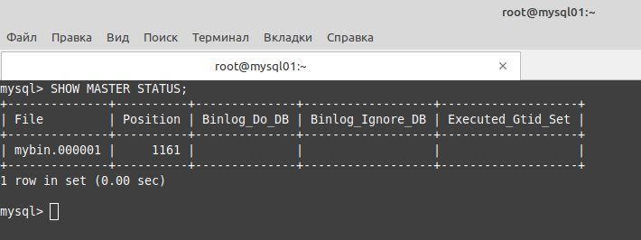
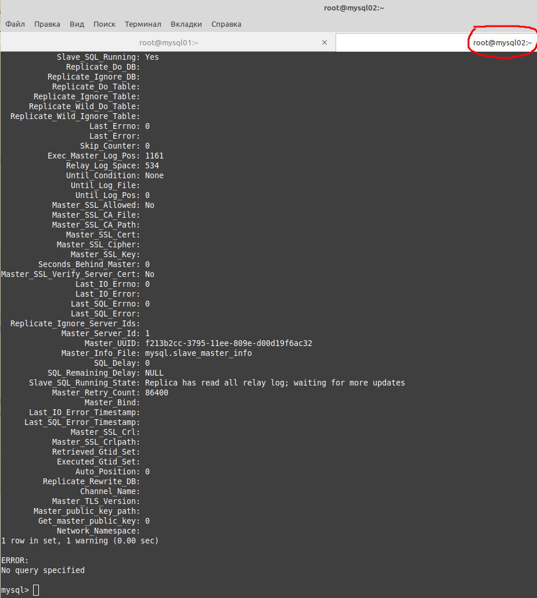
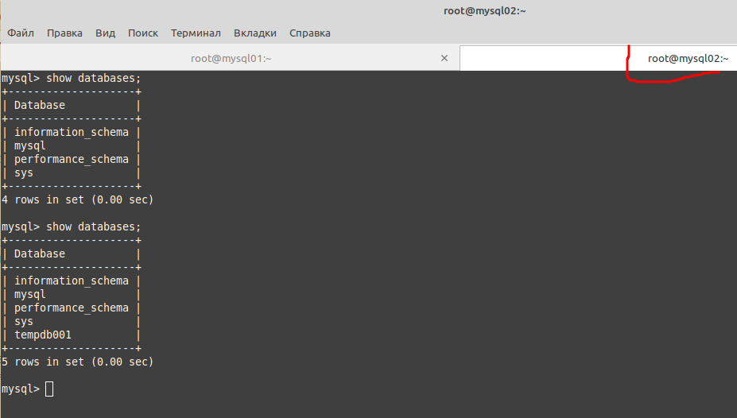
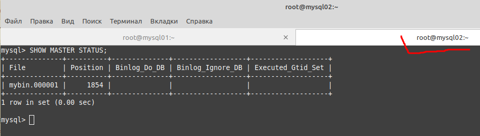
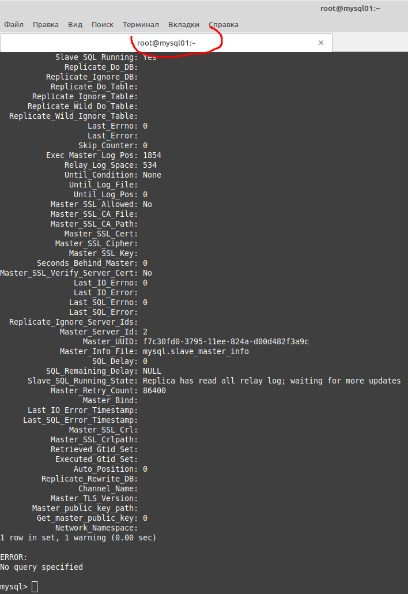
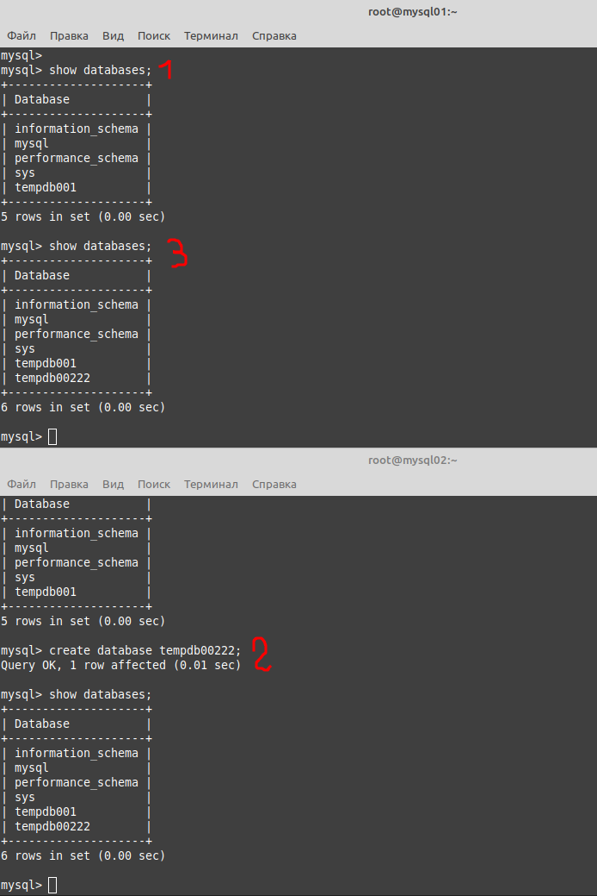

# 12.06. Репликация и масштабирование. Часть 1 - Лебедев Д.С.

### Задание 1
> На лекции рассматривались режимы репликации master-slave, master-master, опишите их различия.
> *Ответить в свободной форме.*

*Ответ:*  
В режиме master-slave один сервер является основным (master), а другой вспомогательным (slave). Изменения происходят на основном сервере и копируются на вспомогательный, с которого следует читать данные. А режим master-master - это тот же самый master-slave, но репликация происходит в обе стороны.
### Задание 2
> Выполните конфигурацию master-slave репликации, примером можно пользоваться из лекции.
> *Приложите скриншоты конфигурации, выполнения работы: состояния и режимы работы серверов.*

*Ответ:*  
Задание выполнялось на виртуальных машинах Centos 7 в YC.  


Подготовка, команды на обеих ВМ:  
```sh
yum -y install wget nano
wget https://dev.mysql.com/get/mysql80-community-release-el7-6.noarch.rpm
rpm --import https://repo.mysql.com/RPM-GPG-KEY-mysql-2022
rpm -Uvh mysql80-community-release-el7-6.noarch.rpm
yum -y install mysql-server mysql-client
mysqld --initialize
mkdir -p /var/log/mysql
chown -R mysql: /var/lib/mysql
chown -R mysql: /var/log/mysql

# правим конфиг
nano /etc/my.cnf
---
bind-address=0.0.0.0
server-id=1 (2 для mysql02)
log_bin=/var/log/mysql/mybin.log
---

# выводим текущий пароль рута для первого входа
cat /var/log/mysqld.log

# стартуем БД
systemctl start mysqld
```

Работа с БД на обеих ВМ:  
```sql
mysql -p

# изменение пароля рута
ALTER USER 'root'@'localhost' IDENTIFIED BY '1234';
FLUSH PRIVILEGES;

# создание и настройка пользователя для репликации
CREATE USER 'replication'@'%' IDENTIFIED WITH mysql_native_password BY 'Repl11Pass!';
GRANT REPLICATION SLAVE ON *.* TO 'replication'@'%';
```

Вывод позиции репликации мастер-ноды:  
```sql
SHOW MASTER STATUS;
```

  

Назначаем вторую ВМ slave-нодой:  
```sql
CHANGE MASTER TO MASTER_HOST='10.128.0.29', MASTER_USER='replication', MASTER_PASSWORD='Repl11Pass!', MASTER_LOG_FILE = 'mybin.000001', MASTER_LOG_POS = 1161;
START SLAVE;
SHOW SLAVE STATUS\G;
```



Проверка работы репликации: создание новой БД на мастер-ноде, проверяем появление этой БД на slave-ноде:  
```sql
--master--
show databases;
create database tempdb001;

--slave--
show databases;
```



### Задание 3*
> Выполните конфигурацию master-master репликации. Произведите проверку.
> *Приложите скриншоты конфигурации, выполнения работы: состояния и режимы работы серверов.*

*Ответ:*  
Вывести позицию на SLAVE-ноде:  
  

Для реализации режима master-master необходимо назначить режим SLAVE той ноде, которая выполняла ранее только роль MASTER:  
```sql
--slave--
SHOW MASTER STATUS;
--master--
CHANGE MASTER TO MASTER_HOST='10.128.0.30', MASTER_USER='replication', MASTER_PASSWORD='Repl11Pass!', MASTER_LOG_FILE = 'mybin.000001', MASTER_LOG_POS = 1854;
START SLAVE;
SHOW SLAVE STATUS\G;
```



Проверяем работу созданием новой БД на бывшей SLAVE-ноде:  
```sql
---mysql02---
show databases;
create database tempdb00222;
```

