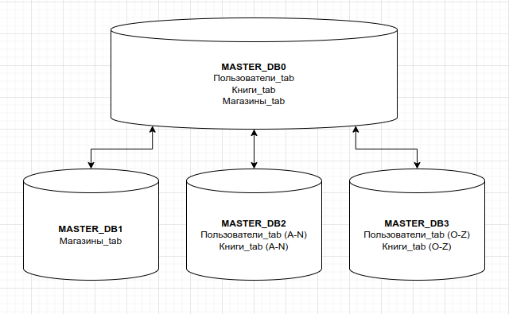
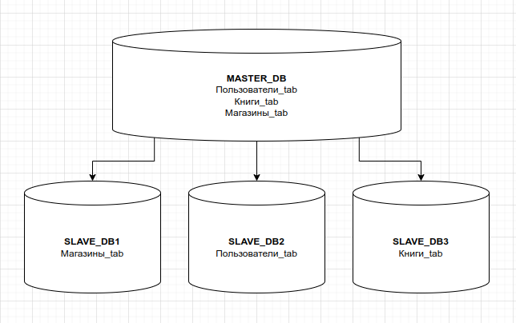

# 12.07. Репликация и масштабирование. Часть 2 - Лебедев Д.С.

### Задание 1
> Опишите основные преимущества использования масштабирования методами:  
> - активный master-сервер и пассивный репликационный slave-сервер;
> - master-сервер и несколько slave-серверов;
> - активный сервер со специальным механизмом репликации — distributed replicated block device (DRBD);
> - SAN-кластер.
> *Дайте ответ в свободной форме.*

*Ответ:*  

Судя по перечисленным методам, все они относятся к горизонтальному масштабированию (scaling out) MySQL. Масштабирование в MySQL – это нетривиальный процесс, в котором нет решений на все случаи жизни. Горизонтальное масштабирование предъявляет высокие требования к знанию не только архитектуры MySQL, но и архитектуры на уровне приложений, что приводит к большим трудозатратам.
В общем случае, первые два метода используются для масштабирования, а вторые два метода больше работают на отказоустойчивость.

### Задание 2
> Разработайте план для выполнения горизонтального и вертикального шаринга базы данных. База данных состоит из трёх таблиц:  
> - пользователи,
> - книги,
> - магазины (столбцы произвольно).
> Опишите принципы построения системы и их разграничение или разбивку между базами данных.
> *Пришлите блоксхему, где и что будет располагаться. Опишите, в каких режимах будут работать сервера.*

*Ответ:*  

Один из вариантов горизонтального шардинга: таблица с магазинами на отдельном шарде, половина таблиц пользователей и книг (по алфавиту от A до N) на втором шарде, вторая половина таблиц пользователей и книг (O-Z) на третьем шарде. Сервера в режиме master-master.  

Самый тривиальный способ вертикального шардирования - реплицируем каждую таблицу БД на отдельном шарде. Сервера в режиме master-slave:  

