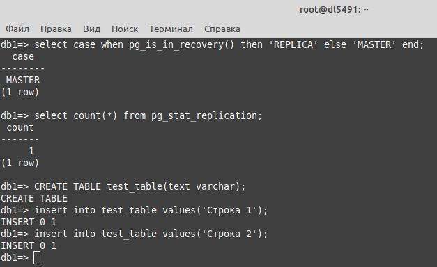
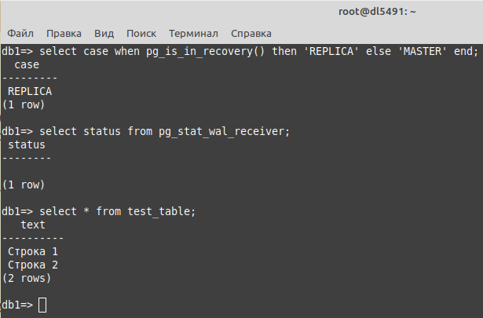
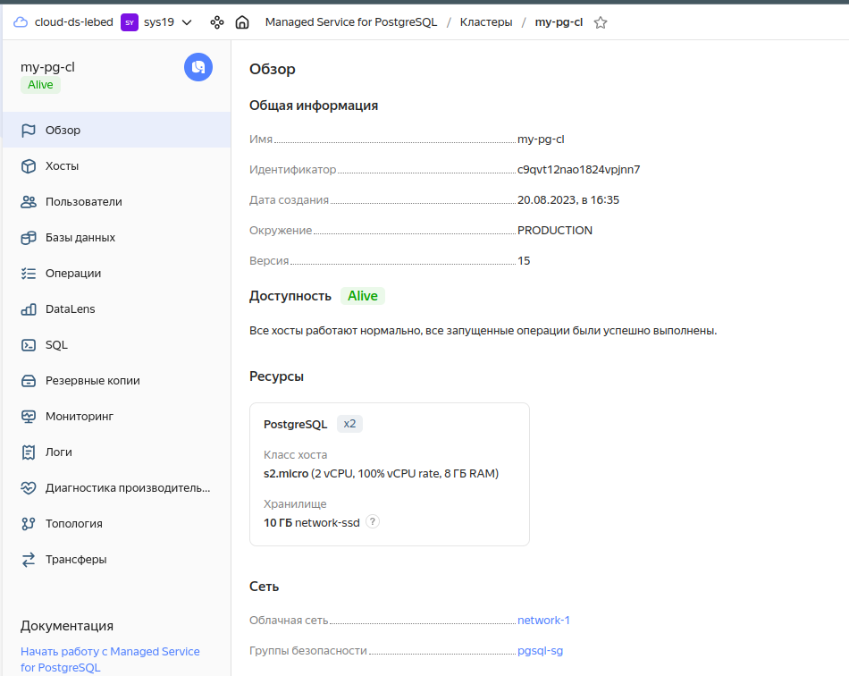
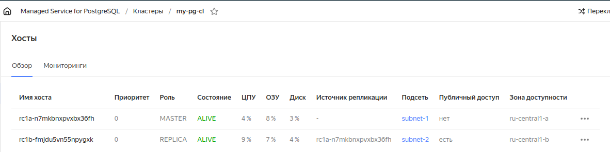

# 12.09. Базы данных в облаке - Лебедев Д.С.
### Задание 1
> **Создание кластера**
> 1. Перейдите на главную страницу сервиса Managed Service for PostgreSQL.
> 2. Создайте кластер PostgreSQL со следующими параметрами:
> - класс хоста: s2.micro, диск network-ssd любого размера;
> - хосты: нужно создать два хоста в двух разных зонах доступности и указать необходимость публичного доступа, то есть публичного IP адреса, для них;
> - установите учётную запись для пользователя и базы.
> Остальные параметры оставьте по умолчанию либо измените по своему усмотрению.
> - Нажмите кнопку «Создать кластер» и дождитесь окончания процесса создания, статус кластера = RUNNING. Кластер создаётся от 5 до 10 минут.
> 
> **Подключение к мастеру и реплике**
> - Используйте инструкцию по подключению к кластеру, доступную на вкладке «Обзор»: cкачайте SSL-сертификат и подключитесь к кластеру с помощью утилиты psql, указав hostname всех узлов и атрибут `target_session_attrs=read-write`.
> - Проверьте, что подключение прошло к master-узлу.
> ```sql
> select case when pg_is_in_recovery() then 'REPLICA' else 'MASTER' end;
> ```
> - Посмотрите количество подключенных реплик:
> ```sql
> select count(*) from pg_stat_replication;
> ```
> 
> **Проверьте работоспособность репликации в кластере**
> - Создайте таблицу и вставьте одну-две строки.
> ```sql
> CREATE TABLE test_table(text varchar);
> insert into test_table values('Строка 1');
> ```
> - Выйдите из psql командой \q.
> - Теперь подключитесь к узлу-реплике. Для этого из команды подключения удалите атрибут target_session_attrs и в параметре атрибут host передайте только имя хоста-реплики. Роли хостов можно посмотреть на соответствующей вкладке UI консоли.
> - Проверьте, что подключение прошло к узлу-реплике.
> ```sql
> select case when pg_is_in_recovery() then 'REPLICA' else 'MASTER' end;
> ```
> - Проверьте состояние репликации
> ```sql
> select status from pg_stat_wal_receiver;
> ```
> - Для проверки, что механизм репликации данных работает между зонами доступности облака, выполните запрос к таблице, созданной на предыдущем шаге:
> ```sql
> select * from test_table;
> ```
> 
>    *В качестве результата вашей работы пришлите скриншоты:*
>    1) Созданной базы данных; 2) Результата вывода команды на реплике `select * from test_table;`.

*Ответ:*  
Установка необходимого ПО:  
```sh
apt install postgresql-client postgresql-client-common
```

Получение SSL-сертификата для подключения к кластеру:  
```sh
mkdir -p ~/.postgresql && \
wget "https://storage.yandexcloud.net/cloud-certs/CA.pem" \
    --output-document ~/.postgresql/root.crt && \
chmod 0600 ~/.postgresql/root.crt
```

Подключение к кластеру, нода MASTER:
```sh
psql "host=rc1a-xxxxx.mdb.yandexcloud.net,rc1b-xxxxx.mdb.yandexcloud.net \
    port=6432 \
    sslmode=verify-full \
    dbname=db1 \
    user=dml \
    target_session_attrs=read-write"
```

Подключение к кластеру, нода REPLICA:
```sh
psql "host=rc1b-xxxxx.mdb.yandexcloud.net \
    port=6432 \
    sslmode=verify-full \
    dbname=db1 \
    user=dml"
```

  



### Задание 2*
> Создайте кластер, как в задании 1 с помощью Terraform.  
> *В качестве результата вашей работы пришлите скришоты:*  
> 1) Скриншот созданной базы данных. 2) Код Terraform, создающий базу данных.

*Ответ:*  
[Создание PostgreSQL-кластера](https://cloud.yandex.ru/docs/managed-postgresql/operations/cluster-create)  
1. Скриншоты созданного кластера:
  

  

2. Код terraform для создание кластера, сетевых ресурсов и БД:
```sh
terraform {
  required_providers {
    yandex = {
      source = "yandex-cloud/yandex"
    }
  }
}

# Описание провайдера YC
provider "yandex" {
  token     = "xxxxx"
  cloud_id  = "xxxxx"
  folder_id = "xxxxx"
  zone      = "ru-central1-a"
}

resource "yandex_mdb_postgresql_cluster" "my-pg-cl" {
  name                = "my-pg-cl"
  environment         = "PRODUCTION"
  network_id          = yandex_vpc_network.network-1.id
  security_group_ids  = [ yandex_vpc_security_group.pgsql-sg.id ]
  deletion_protection = false

  config {
    version = 15
    resources {
      resource_preset_id = "s2.micro"
      disk_type_id       = "network-ssd"
      disk_size          = "10"
    }
  }

  host {
    zone      = "ru-central1-a"
    name      = "mypg-node-a"
    subnet_id = yandex_vpc_subnet.subnet-1.id
  }

  host {
    zone      = "ru-central1-b"
    name      = "mypg-node-b"
    subnet_id = yandex_vpc_subnet.subnet-2.id
    replication_source_name = "mypg-node-a"
    assign_public_ip        = true
  }
}

resource "yandex_mdb_postgresql_database" "db1" {
  cluster_id = yandex_mdb_postgresql_cluster.my-pg-cl.id
  name       = "db1"
  owner      = "dml"
}

resource "yandex_mdb_postgresql_user" "dml" {
  cluster_id = yandex_mdb_postgresql_cluster.my-pg-cl.id
  name       = "dml"
  password   = "gfhjdsiybr"
}

resource "yandex_vpc_network" "network-1" {
  name = "network-1"
}

resource "yandex_vpc_subnet" "subnet-1" {
  name           = "subnet-1"
  zone           = "ru-central1-a"
  network_id     = yandex_vpc_network.network-1.id
  v4_cidr_blocks = ["10.5.0.0/24"]
}

resource "yandex_vpc_subnet" "subnet-2" {
  name           = "subnet-2"
  zone           = "ru-central1-b"
  network_id     = yandex_vpc_network.network-1.id
  v4_cidr_blocks = ["10.6.0.0/24"]
}

resource "yandex_vpc_security_group" "pgsql-sg" {
  name       = "pgsql-sg"
  network_id = yandex_vpc_network.network-1.id

  ingress {
    description    = "PostgreSQL"
    port           = 6432
    protocol       = "TCP"
    v4_cidr_blocks = [ "0.0.0.0/0" ]
  }
}
```

